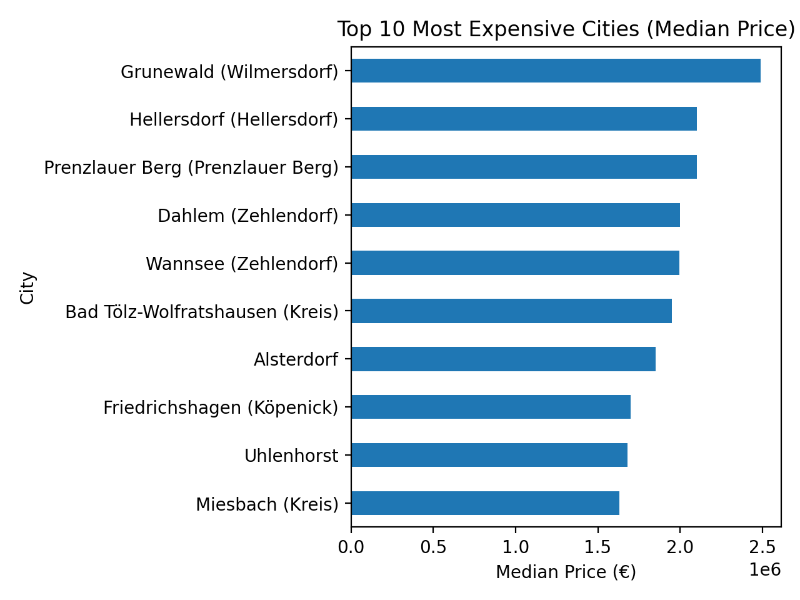
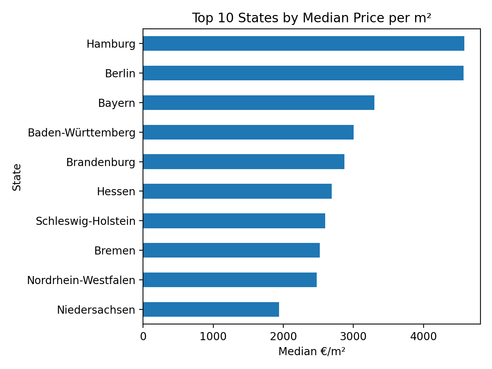
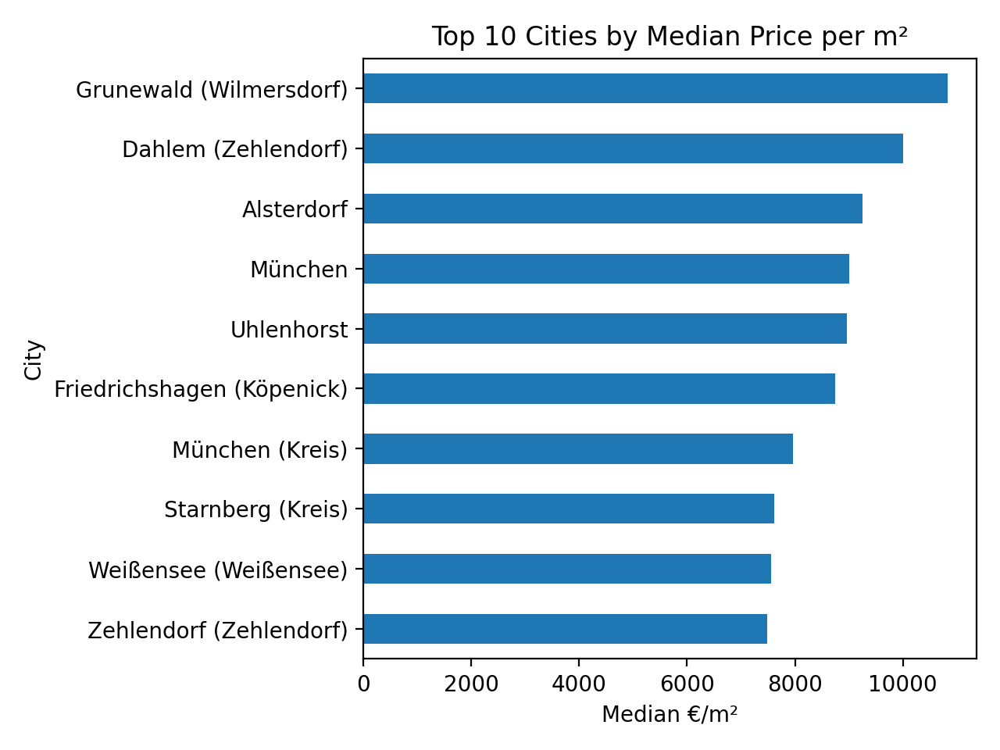
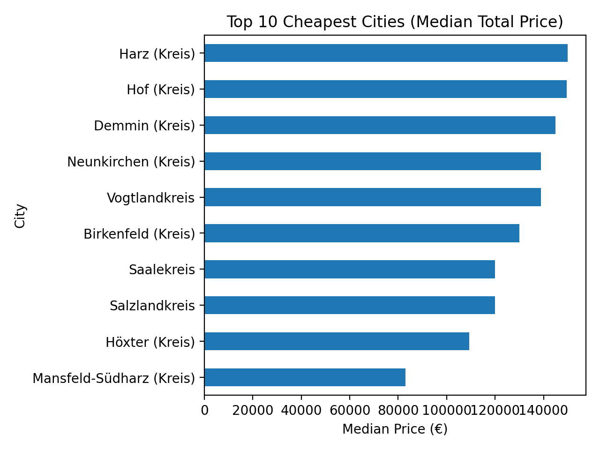
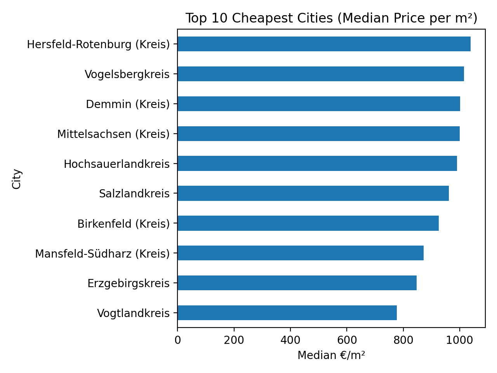

# German Real Estate Market Analysis (Python + Linux)

## Overview
This is a beginner-friendly data analysis project built on Linux using Python.  
The goal is to explore German real estate listings and compare prices across cities and states.

## Tools
- Linux (Ubuntu VM)
- Python (pandas, numpy, matplotlib)
- Jupyter Notebook

## Dataset
Public dataset of real estate listings in Germany (CSV).  
File: `data/raw/germany_housing.csv`

## Project Structure
- `data/raw/` — raw dataset
- `data/processed/` — cleaned datasets (optional)
- `notebooks/` — analysis notebooks
- `results/figures/` — exported charts

## Analysis Steps
1. Loaded the dataset and checked missing values
2. Explored price distribution (including log-scale)
3. Removed extreme outliers (price + living space)
4. Calculated price per m² (€/m²) and removed unrealistic values
5. Identified:
   - Top 10 most expensive cities (median price)
   - Top 10 most expensive cities (median €/m²)
   - Top 10 cheapest cities (median price)
   - Top 10 cheapest cities (median €/m²)
   - Top 10 states by median €/m²

## Key Findings (Short)
- Premium districts in Berlin and the Munich region dominate the expensive city rankings.
- Hamburg and Berlin show the highest median €/m² among states.
- Rural districts appear in the cheapest €/m² ranking.
- Price per m² is more comparable than total price.

## Results (Charts)
Charts are saved in `results/figures/`, for example:
- `top_10_cities_price_per_m2.png`
- `top_10_states_price_per_m2.png`
- `top_10_cheapest_cities_price_per_m2.png`

## Charts Preview

### Top 10 Most Expensive Cities (Median Price)


### Top 10 States by Median Price per m²


### Top 10 Cities by Median Price per m²


### Top 10 Cheapest Cities (Median Total Price)


### Top 10 Cheapest Cities (Median Price per m²)


## How to Run
```bash
cd real_estate_analysis
python3 -m venv .venv
source .venv/bin/activate
pip install -r requirements.txt
jupyter notebook

## Notebook Report (HTML)
Full notebook export: [01_eda_germany_real_estate.html](docs/01_eda_germany_real_estate.html)
